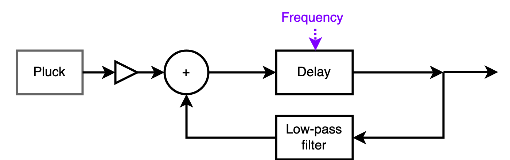

# Karplus-Strong Algorithm

## Architecture

The Karplus-Strong algorithm allows us to simulate a string sound using Signal Processing System. The architecture consists of -

- Burst generator - This is the input to the system at the start of the sound generation. It consists of a noise signal for a short duration. IDeally, the noise signal must consist of frequencies iwth equal amplitude for a wide range of frequencies in order to obtain the appropriate string sound simulation across time.

- Delay line - The delay line provides a phase shift to the Burst generated samples. This phase shift is analogous to the wave getting reflected at the endpoints of the string. These reflections also create interference with opposite waves, creating an overall standing wave signature.

- Low-pass filter - The low pass filter performs a gradual decay of high frequency components that are not the resonant frequencies of the string being plucked. As time progresses, the fundamental resonant frequency of the string remains amplified and this is acheived by the low pass filter only allowing this particular resonant frequency in the system.

- Cumulator - The cumulator aggregates the sound samples such that the old samples are filtered by the low pass filter and the new samples of uniform frequency distribution are added to the filtered old samples. This is done to reinforce and continue the standing wave vibration in the string. The cumulator also simulates the wave interference of different ave components.

### Diagram

## Analysis of Blocks
