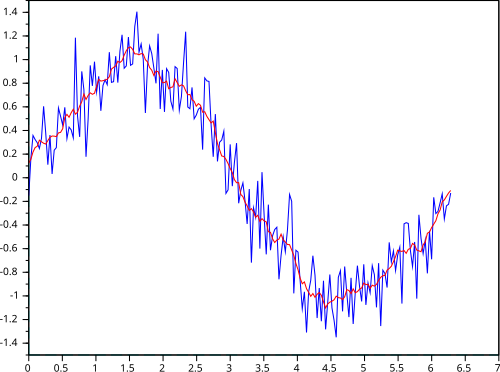

# Moving Average as Low-Pass Filter

## Introduction

Moving average is said to approximate a low-pass filter implementation as a mathematical alternative in Signal Processing. This doc covers this correlation with simple explanations.

## Moving Average

Moving average is defined in various forms depending on the application of the concept. In signal processing, it is defined as the mean average of the values in both sides to the central value. This is done to ensure the Moving Average is obtained from the data points rather than containing an implicit time shift contribution.

The Simple Moving Average (SMA) is calculated as:

$$
\begin{aligned}
\textit{SMA}_k &= \frac{p_{n-k+1} + p_{n-k+2} + \cdots + p_n}{k} \\
&= \frac{1}{k} \sum_{i=n-k+1}^{n} p_i
\end{aligned}
$$

The moving average acts as a bare-bone Convolution operation.

Convolution is calculated as:

$$
\begin{aligned}
(f * g)[n] &= \sum_{m=-\infty}^{\infty} f[m] \cdot g[n-m] \\
&= \cdots + f[-1] \cdot g[n+1] + f[0] \cdot g[n] + f[1] \cdot g[n-1] + \cdots
\end{aligned}
$$

Assuming that the weights to the input samples during Convolution are all equal to the reciprocal of the number of samples (1/k), we can see that the Convolution and Moving average equations are alike.

## Comparison to Low-Pass filter

Without having to dive deep into the characteristics of the Low-pass filter from an Analog circuit perspective, we can compare the Low-pass filter with Moving avergae based on the definition. A low pass filter only allows signals with lower frequency components (including DC component) to pass the circuit and blocking the higher frequency components.

We can visualize two signals, one with higher fluctuations and noise & the second one being the moving average of the first signal side by side.

One can easily notice that the moving average is a smoother version of the original signal and represents a signal that only has frequency components at the lower end of the spectrum. Hence correlating the moving avergae with the low-pass filter.
